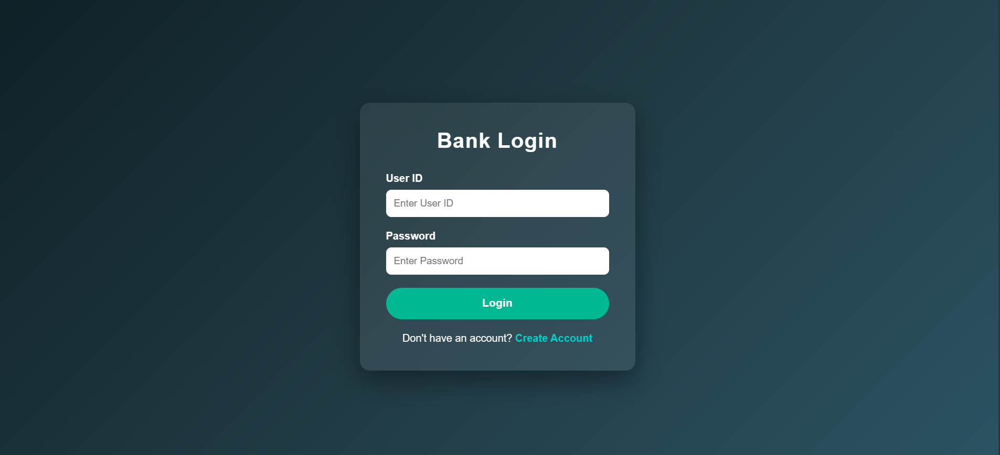
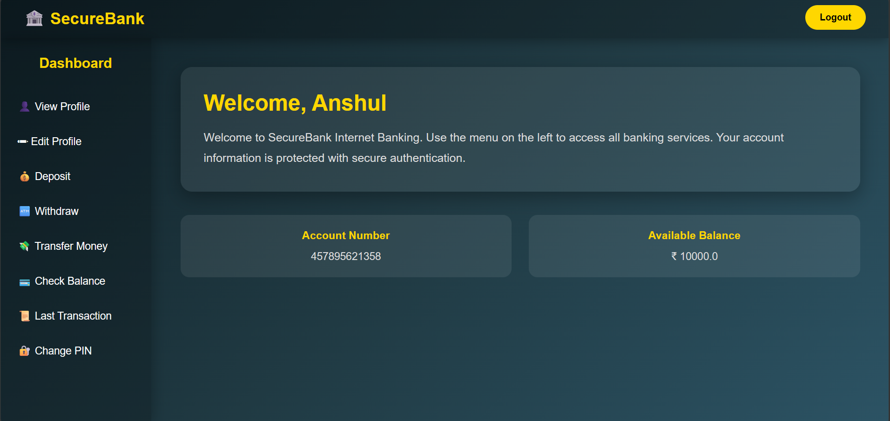

# 🏦 SecureBank - Bank Management System


A secure and user-friendly **Bank Management System** developed using **Java, JSP, Servlets, JDBC, MySQL, and MVC Architecture**. The application provides essential banking services such as account management, money transfer, deposits, withdrawals, profile management, transaction history, and PIN management with proper validations.

---

# 📌 Features

- User Registration
- User Login & Logout
- View Profile
- Edit Profile
- Deposit Money
- Withdraw Money
- Transfer Money
- Check Account Balance
- View Transaction History
- Change Transaction PIN
- Session Management
- Input Validation
- Secure Database Operations
- Responsive User Interface

---

# 🛠️ Technology Stack

| Technology | Usage |
|------------|-------|
| Java | Backend Logic |
| JSP | Frontend Pages |
| Jakarta Servlet | Request Processing |
| JDBC | Database Connectivity |
| MySQL | Database |
| HTML5 | Page Structure |
| CSS3 | Styling |
| Apache Tomcat 11 | Web Server |
| MVC Architecture | Project Structure |

---

# 📂 Project Structure

```
SecureBank/
│
├── src/
│   ├── controllers/
│   ├── models/
│   ├── dao/
│
├── WebContent/
│   ├── css/
│   ├── images/
│   ├── *.jsp
│
├── database/
│   └── securebank.sql
│
├── screenshots/
│
├── README.md
└── LICENSE
```

---

# 🏛️ MVC Architecture

```
        User
          │
          ▼
        JSP Pages
          │
          ▼
      Servlet Controller
          │
          ▼
       DAO (JDBC)
          │
          ▼
      MySQL Database
```

---

# 💳 Banking Modules

### Authentication

- Register
- Login
- Logout

### Account Services

- View Profile
- Edit Profile
- Check Balance

### Transactions

- Deposit Money
- Withdraw Money
- Transfer Money
- Transaction History

### Security

- Change PIN
- Session Validation
- SQL Injection Prevention using PreparedStatement

---

# ✅ Validations Implemented

### Registration

- Empty Field Validation
- Email Validation
- Mobile Number Validation
- Password Validation
- Duplicate Email Check
- Duplicate Account Check

### Login

- Invalid Credentials
- Empty Input Validation
- Session Validation

### Deposit

- Positive Amount Validation
- PIN Validation

### Withdraw

- Positive Amount Validation
- Sufficient Balance Check
- PIN Validation

### Transfer

- Sender Account Validation
- Receiver Account Validation
- Self Transfer Restriction
- Sufficient Balance Validation
- PIN Validation
- Transaction Rollback Support

### Profile

- Name Validation
- Email Validation
- Mobile Validation
- Address Validation

### Change PIN

- Current PIN Verification
- New PIN Validation
- Confirm PIN Matching

---

# 🔒 Security Features

- Session Management
- PreparedStatement (SQL Injection Prevention)
- Input Validation
- PIN Verification
- Database Transaction Management
- Rollback Support
- Browser Cache Prevention
- Secure Login Validation

---

# 🗄️ Database

Main Tables:

- users
- transactions

---

# 📷 Application Screenshots

Add screenshots inside the **screenshots** folder.

Example:

```
screenshots/
│
├── login.png
├── register.png
├── dashboard.png
├── deposit.png
├── withdraw.png
├── transfer.png
├── profile.png
├── transaction-history.png
└── change-pin.png
```

After uploading screenshots, display them like this:

```markdown
## Login



## Dashboard


```

---

# ⚙️ Installation

## Clone Repository

```bash
git clone https://github.com/yourusername/Bank-Management-System.git
```

## Import Project

- Open Eclipse IDE
- Import Existing Dynamic Web Project
- Configure Apache Tomcat
- Add MySQL Connector JAR

## Database Setup

- Create Database

```sql
CREATE DATABASE securebank;
```

- Import

```
database/securebank.sql
```

- Update database credentials inside the DAO classes.

## Run

Start Tomcat Server

Open

```
http://localhost:8080/BankManagementSystem
```

---

# 🚀 Future Enhancements

- OTP Verification
- Email Notifications
- SMS Alerts
- Admin Dashboard
- Online Bill Payments
- Loan Management
- Internet Banking
- Mobile Banking API
- Password Encryption (BCrypt)
- Spring Boot Migration

---

# 👨‍💻 Author

**Anshul Dhoble**

Backend Developer (Java)

### Skills

- Core Java
- Advanced Java
- JSP
- Servlets
- JDBC
- MySQL
- MVC Architecture
- SQL

---

# ⭐ If you like this project

Please consider giving this repository a **Star**.

It motivates me to build more Java projects.

---

## 📄 License

This project is licensed under the MIT License.
